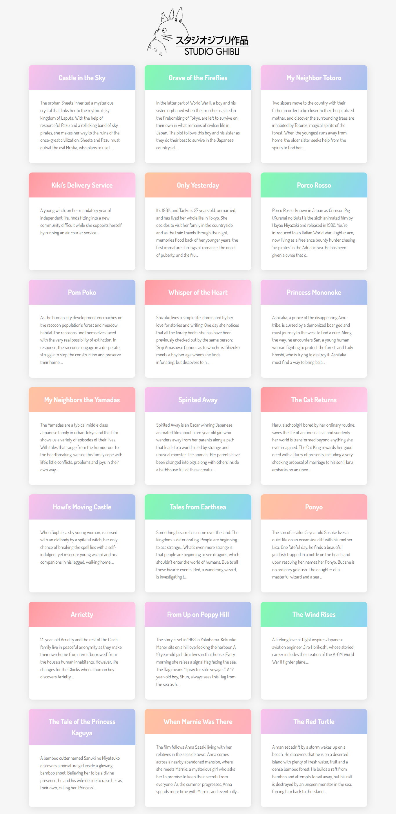

# GHIBLI APP

This is an API practice project. I used Javascript to connect to the Studio Ghibli API using HTTP requests. I learned API endpoints, how the browser communicates with third-party API data with requests and responses, 
and how to parse JSON into arrays and objects that JavaScript understands.
